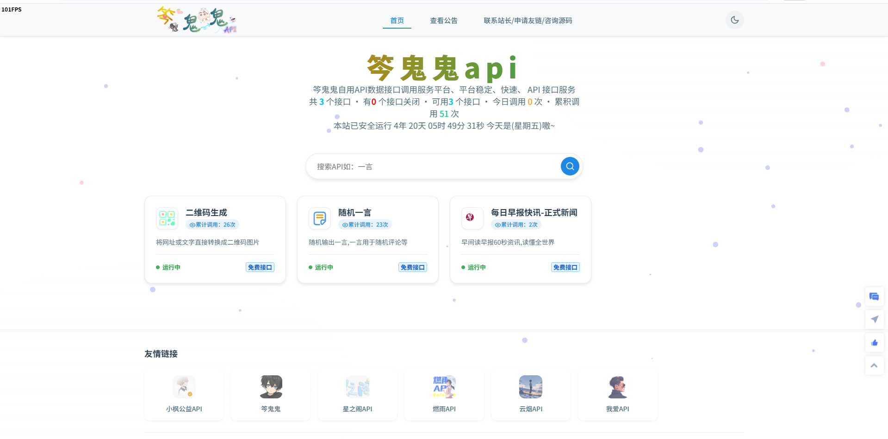
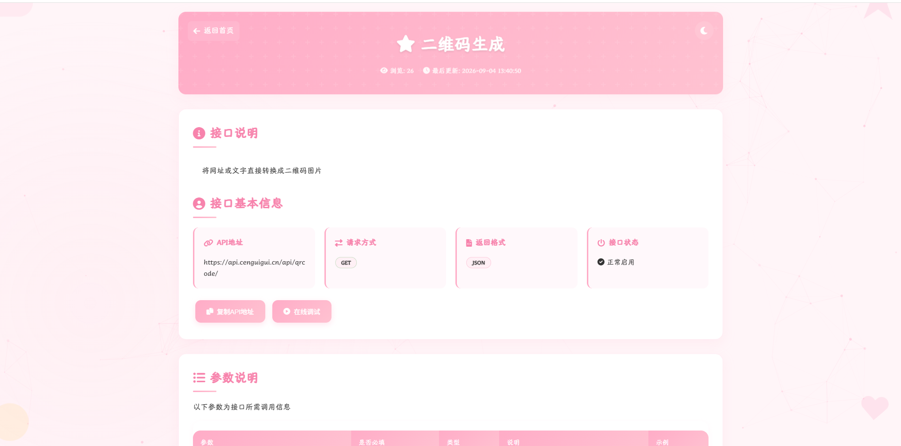
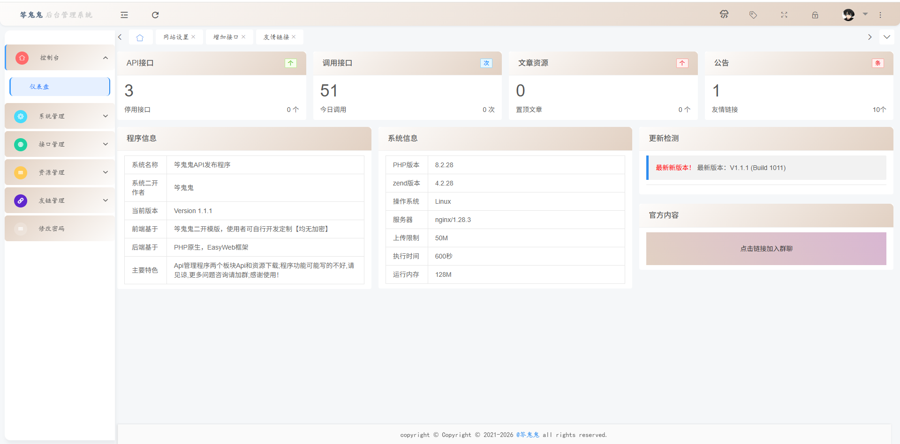

<p align="center">
  
</p>

<h1 align="center">笒鬼鬼API管理系统</h1>

<p align="center">
  一套基于 PHP + MySQL 的轻量级 API 发布、文档展示、调用统计与后台管理系统。
</p>

<p align="center">
  <a href="https://api.cenguigui.cn/">在线演示</a> ·
  <a href="#快速安装">快速安装</a> ·
  <a href="#项目截图">项目截图</a> ·
  <a href="#赞赏支持">赞赏支持</a>
</p>

## 项目介绍

笒鬼鬼API管理系统由笒鬼鬼在早期 API 管理程序的基础上进行二次开发与界面美化，适合个人站长、小型团队或学习者自行部署。系统同时提供前台 API 展示页和后台管理面板，可管理接口、站点设置、资源、友情链接及调用统计。

当前开源版本：`1.1.1`。

> 在线演示站仅用于功能预览，请勿对演示接口进行高频或生产调用。

## 主要功能

- API 接口的新增、编辑、启用、停用和文档展示
- API 请求示例、参数说明、返回示例及在线测试入口
- 每日与累计调用次数统计
- 公告、站点信息、主题、友情链接和资源下载管理
- 独立后台登录与响应式管理界面
- 多套前台主题及深浅色显示效果
- 内置随机一言、二维码生成、每日早报示例接口
- 浏览器安装向导，自动导入数据库并生成本地配置

## 运行环境

- Linux 服务器
- Nginx 或 Apache
- PHP 8.0 及以上版本，推荐 PHP 8.2
- MySQL 5.7 及以上版本，或兼容的 MariaDB
- PHP 扩展：`pdo_mysql`、`mysqli`、`curl`、`gd`、`mbstring`

## 快速安装

### 1. 下载源码

```bash
git clone https://github.com/cenguigui/guigui-api-management-system.git
cd guigui-api-management-system
```

也可以在 GitHub Releases/Code 菜单中下载 ZIP，再将源码上传到网站根目录。

### 2. 配置站点

将网站运行目录指向项目根目录，并为 Web 服务用户提供必要的读取权限。安装期间以下目录需要可写：

- `includes/`：生成本地数据库配置
- `install/`：生成安装锁
- `down/upload/`：资源图片上传
- `api/zaobao/`：每日早报缓存

请根据服务器环境设置所有者和最小必要权限，不建议长期使用 `777`。

### 3. 配置 Nginx 伪静态

宝塔面板用户可在“网站 → 设置 → 伪静态”中加入：

```nginx
location / {
    rewrite ^/index\.html$ /index.php last;
    rewrite ^/sitemap\.xml$ /sitemap.php last;
    rewrite ^/start$ /stats_display.php last;
    rewrite ^/api/([A-Za-z0-9_]+)\.html$ /api.php?alias=$1 last;
    rewrite ^/down-([1-9][0-9]*)\.html$ /down/down.php?id=$1 last;
    rewrite ^/down\.html$ /down/index.php last;
}
```

PHP 请求仍需使用服务器原有的 FastCGI/PHP 配置；宝塔面板通常会自动生成。

### 4. 运行安装向导

打开：

```text
https://你的域名/install/
```

填写数据库地址、数据库账号以及后台管理员账号。安装向导会：

1. 创建或选择数据库；
2. 导入 `install/api.sql`；
3. 生成 `includes/database.php`；
4. 生成 `install/install.lock`；
5. 使用你填写的管理员账号覆盖初始账号。

安装完成后访问：

```text
https://你的域名/admin/
```

### 5. 安装后加固

- 立即确认后台使用的是强密码；不要继续使用安装表单中的示例密码。
- 保留 `install/install.lock`，并在确认部署正常后删除或禁止公网访问 `install/`。
- 开启 HTTPS，并限制数据库账号只拥有当前数据库所需权限。
- 定期备份数据库和用户上传目录。
- 正式上线前请自行完成代码、接口数据来源和服务器配置的安全审计。

## 手动安装

不使用安装向导时：

1. 创建数据库并导入 `install/api.sql`；
2. 将 `includes/database.php.example` 复制为 `includes/database.php`；
3. 填写数据库地址、账号、密码与库名；
4. 登录后台后立即修改初始管理员信息。

初始账号仅用于首次进入后台：

```text
用户名：admin
密码：123456
```

`includes/database.php` 与 `install/install.lock` 均已加入 `.gitignore`，不会被提交到 GitHub。

## 常用地址

| 功能 | 地址 |
| --- | --- |
| 网站首页 | `/` |
| 后台管理 | `/admin/` |
| 安装向导 | `/install/` |
| API 列表 | `/apilist.html` |
| 资源下载 | `/down.html` |
| 站点地图 | `/sitemap.xml` |
| 调用统计总览 | `/start` |
| 指定接口统计 | `/start?alias=接口别名` |

## 接口统计接入

在需要统计的 PHP 接口中引入统计模块，并传入后台配置的接口别名：

```php
<?php
include $_SERVER['DOCUMENT_ROOT'] . '/includes/api_stats.php';

// 参数必须与后台接口列表中的别名保持一致。
updateApiStatsByAlias('your_api_alias');
```

## 目录说明

| 路径 | 用途 |
| --- | --- |
| `admin/` | 后台管理与登录 |
| `api/` | 示例 API 接口 |
| `assets/` | 后台及公共静态资源 |
| `down/` | 资源下载模块 |
| `includes/` | 数据库、公共函数、统计与成员逻辑 |
| `install/` | 安装向导与初始化 SQL |
| `template/` | 前台主题模板 |
| `docs/` | 项目截图等文档资源 |

## 项目截图

### 前台首页



### API 详情页



### 后台仪表盘



### 后台登录页


## 二次开发

- 新接口建议放在 `api/` 下，并在后台新增相同别名的接口记录。
- 修改域名后，可参考 [数据库域名批量替换说明](换域名搭建-数据库域名替换.md)。
- 图标修改方式见根目录的 `图标配置-1.png`、`图标配置-2.png`、`图标配置-3.png`。
- 提交代码前请确保中文文件保持 UTF-8 编码，数据库凭据、安装锁和运行日志未被加入 Git。

欢迎通过 Issue 报告问题，通过 Pull Request 提交修复或改进。

## 数据与责任说明

本项目仅提供 API 管理与展示程序。使用者应自行确认所接入接口、图片、文字及其他数据的授权情况，并遵守所在地法律法规和第三方服务条款。请勿将本项目用于违法用途、未授权采集、侵权传播或攻击行为。

本项目包含的第三方前端库、字体与素材，其著作权及许可仍归各自权利人所有，不因本仓库的开源许可证而改变。

## 赞赏支持

如果这个项目对你有帮助，欢迎赞赏支持后续维护。

<table>
  <tr>
    <th>微信赞赏</th>
    <th>支付宝赞赏</th>
  </tr>
  <tr>
    <td></td>
    <td></td>
  </tr>
</table>

## 开源许可

本项目中由作者原创或有权授权的代码采用 [MIT License](LICENSE) 开源。第三方组件与素材适用其各自的许可证或权利声明。

## 作者

- GitHub：[@cenguigui](https://github.com/cenguigui)
- 在线演示：[api.cenguigui.cn](https://api.cenguigui.cn/)

